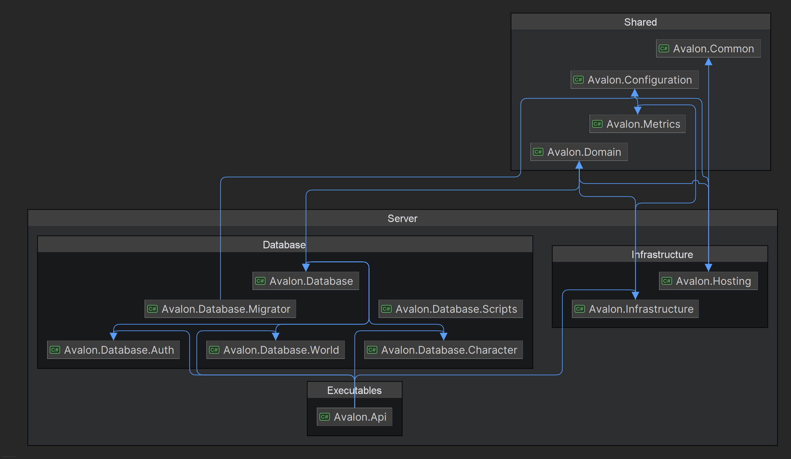
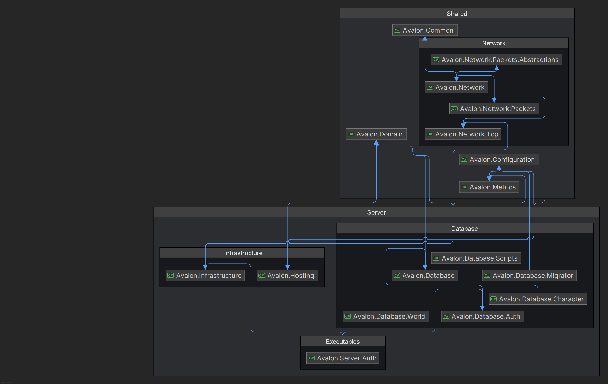
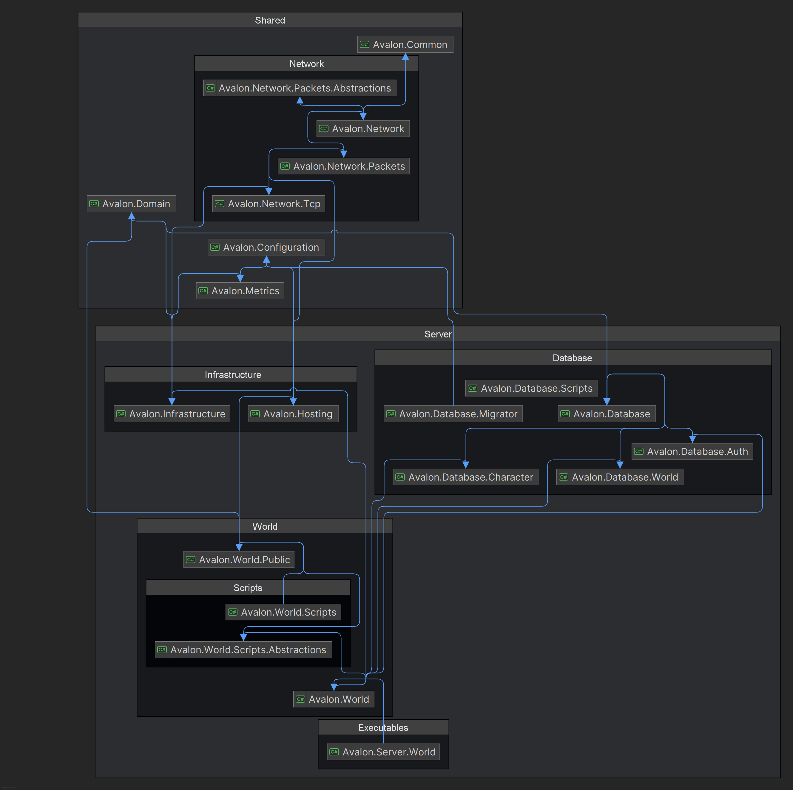
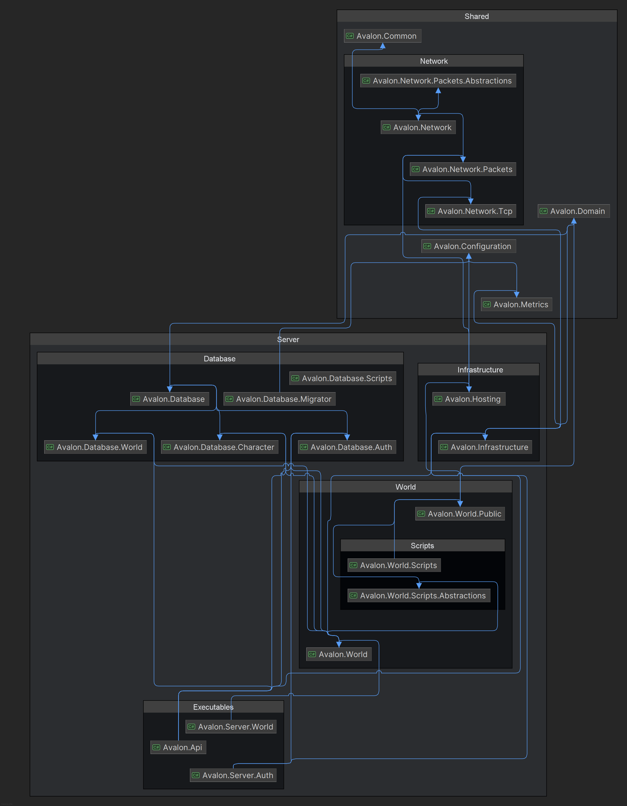
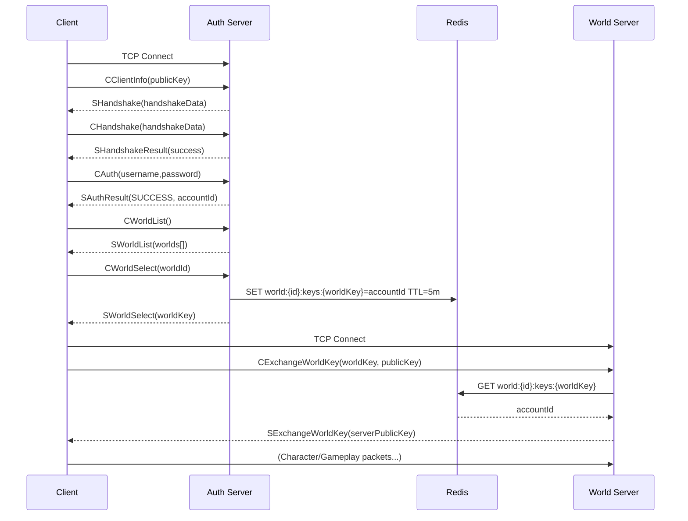

# Avalon.Server

Official server-side solution for the Avalon MMORPG: API, authentication, world simulation, networking, persistence,
telemetry, and extensibility frameworks.

## Architecture Diagrams

(See /docs for visual diagrams.)

- API: 
- Auth Server: 
- World Server: 
- General Overview: 

## High-Level Overview

Avalon is split into bounded components that can scale and evolve independently:

- Public REST API (account + meta operations)
- Real‑time Auth server (login / token / world selection)
- Real‑time World server (simulation, state replication, gameplay logic)
- Shared foundational libraries (domain model, networking, value objects, metrics, configuration)
- Infrastructure services (Redis, Postgres)
- Tooling (migrations, benchmarking, scripting, migration console)

Communication paths:

- Clients → API (HTTPS + JWT) for out‑of‑band operations (account, web UX, management)
- Game Client → Auth Server (custom TCP packet protocol) for authentication & world ticket exchange
- Auth Server ↔ Redis (session, ephemeral keys, pub/sub)
- World Server ↔ Redis (cross‑node coordination, session/materialized view, pub/sub)
- World Server ↔ Databases (persistent character/world state)
- API ↔ Databases (account + world metadata) & Redis (caching, notifications)

## Solution Structure (Key Projects)

Server layer:

- `src/Server/Avalon`: The [Aspire](https://dotnet.microsoft.com/en-us/apps/aspire) host for all server components.
- `src/Server/Avalon.Api`: ASP.NET Core REST API; OpenAPI generation; JWT issuance; JSON serialization customization.
- `src/Server/Avalon.Server.Auth`: Hosted service wrapping AuthServer (packet dispatcher, login flow, MFA support).
- `src/Server/Avalon.Server.World`: Hosted service running the simulation loop (maps, entities, spells, movement,
  spawning).
- `src/Server/Avalon.World`: Core world implementation (maps, grid management, entities, spells, sessions, connection
  orchestration).
- `src/Server/Avalon.World.Public`: Public abstractions (interfaces) consumed by other layers (decouples implementation).
- `src/Server/Avalon.World.Scripts` / `.Abstractions`: Scripting system boundary (gameplay extensions, isolated logic).
- `src/Server/Avalon.Infrastructure`: Cross‑cutting infra services (Redis replicated cache, MFA hashing, config binding,
  helper services).
- `src/Server/Avalon.Database.*`: EF Core contexts and repositories (Auth, Character, World) + migrations.
- `src/Server/Avalon.Hosting`: Uniform host bootstrap (AvalonHostBuilder) adding converters, telemetry, configuration.
- src/Server/Avalon.ServiceDefaults: Shared service registration (logging, OpenTelemetry, resiliency, service discovery
  if enabled).
- src/Server/Avalon.PluginFramework: Foundation for dynamic/extensible plugin loading (future roadmap for gameplay/content modules).

Shared libraries:

- src/Shared/Avalon.Common: Primitive abstractions, ValueObject<T>, common utilities & JSON converters.
- src/Shared/Avalon.Domain: Rich domain model (Auth, Accounts, Devices, Worlds, etc.).
- src/Shared/Avalon.Configuration: Strongly typed configuration objects (DatabaseConfiguration, CacheConfiguration,
  Authentication, Application config layer).
- src/Shared/Avalon.Network / .Tcp / .Packets / .Packets.Abstractions: Custom packet protocol, attributes, base
  handlers, contracts.
- src/Shared/Avalon.Metrics: Metrics abstraction (OpenTelemetry integration points).

Tooling & Tests:

- tools/Avalon.Database.Migrator.Console & Avalon.Tools.Migrations: CLI + EF design‑time support for applying/creating
  migrations.
- tools/Avalon.Benchmarking: Micro-benchmarks for performance‑sensitive components.
- tests/Avalon.Shared.UnitTests: Unit tests for shared libraries.
- tests/Avalon.Server.Auth.UnitTests: Unit tests for authentication server components.
- tests/Avalon.Server.World.UnitTests: Unit tests for world server and simulation logic.
- tests/Avalon.Api.UnitTests: Unit tests for the REST API.

## Core Cross-Cutting Concepts

### Value Objects

Located in Avalon.Common (ValueObject<TValue>) ensuring strong typing and semantic clarity (e.g., AccountId, WorldId).
They:

- Serialize to their underlying primitive via custom System.Text.Json converters.
- Expose OpenAPI schemas as simple scalars through ValueObjectOpenapiSchemaTransformer (see below).

### OpenAPI & Scalar UI

The API registers Microsoft.AspNetCore.OpenApi (net9) and uses AddOpenApi + MapOpenApi with Scalar UI for interactive
docs. A custom schema transformer produces scalar definitions for value objects, avoiding noisy wrapper shapes.

### Authentication & Security

- JWT issuance and validation (Microsoft.AspNetCore.Authentication.JwtBearer)
- MFA (Otp.NET) with Redis-backed ephemeral secrets
- Password hashing (BCrypt)
- Refresh tokens & session tracking in AuthDb

### Networking

- Custom TCP layer (Avalon.Network.Tcp) with packet dispatch
- Packet metadata via attributes (e.g., opcodes) enabling reflection-based handler registration
- Auth and World servers consume shared packet abstractions

#### Custom Packet Protocol

Transport: Plain TCP sockets (one connection per phase: Auth, then World). Higher-level reliability handled by TCP;
ordering guaranteed.
Serialization: Protobuf-net contracts. Every high-level packet wraps a NetworkPacket (Header + Payload).
Encryption: Session crypto negotiated via ephemeral public key exchange during handshake stages (Auth and again for
World). After success, payload encryption flag can be enabled.

Header (NetworkPacketHeader):

- Type (NetworkPacketType): Semantic opcode / message type (e.g., CAuthPacket → CMSG_AUTH, SAuthResultPacket →
  SMSG_AUTH_RESULT).
- Flags (NetworkPacketFlags): Bitmask (e.g., Encryption, Compression, Reserved). Enables fast checks without parsing
  payload.
- Protocol (NetworkProtocol): Logical channel / grouping (e.g., Authentication, World, Social, Character). Supports
  multiplexing and routing.
- Version (int): Protocol version for backward compatibility / progressive migrations.
  Size calculation uses fixed field lengths; header marshaled first enabling preallocation.

High-Level Lifecycle (Auth Phase):

1. CClientInfoPacket: Client sends its ephemeral public key.
2. SHandshakePacket: Server returns handshake data (server challenge & possibly server public key or salt data).
3. CHandshakePacket: Client proves possession / echoes handshake data.
4. SHandshakeResultPacket: Indicates success (and signals encryption activation).
5. CAuthPacket: Credentials (username, password hash/plain depending on design; currently plaintext then server Bcrypt
   verify).
6. SAuthResultPacket: Status (SUCCESS, LOCKED, MFA_REQUIRED, etc.) and AccountId on success.
7. CWorldListPacket: Client requests accessible world list.
8. SWorldListPacket: Worlds filtered by account access level.
9. CWorldSelectPacket(WorldId): Client chooses target world.
10. SWorldSelectPacket(worldKey): Server issues short‑lived, base64 worldKey stored in Redis with TTL for handoff.

World Handoff:

11. Client opens new TCP connection to World server.
12. CExchangeWorldKeyPacket(worldKey, publicKey): Provides issued key + new ephemeral public key for world session.
13. World server validates key via Redis (single-use), loads account, initializes crypto.
14. SExchangeWorldKeyPacket(serverPublicKey): Confirms acceptance & provides server public key.
15. Subsequent packets (e.g., character list, selection, movement, chat) now proceed under world session context.

Redis Usage in Flow:

- world:{WorldId}:keys:{Base64Key} → AccountId (TTL ~5m) (deleted immediately after successful world key exchange).
- auth:accounts:online / world:accounts:disconnect channels for cross-component presence coordination.

Failure Modes & Safeguards:

- Invalid handshake data → connection closed (avoid resource waste).
- Wrong key size → rejected prior to crypto init.
- Invalid or expired world key → silent reject (prevents brute force enumeration).
- Multiple logins for same account: previously connected session forced disconnect via pub/sub event.

Extensibility Points:

- Add new packet type: define Protobuf contract, assign NetworkPacketType enum value, implement handler (
  IAuthPacketHandler<T> or IWorldPacketHandler<T>), register via reflection scan (attribute-driven).
- Version evolution: Introduce parallel handlers keyed off Header.Version while keeping backward compatibility.
- Optional compression flag: could be introduced via Flags without breaking existing decoding.

Security Considerations:

- Single-use world keys mitigate replay (removed after exchange).
- Separation of Auth and World keys limits blast radius of a compromised session token.
- Public key re-exchange on world join prevents key re-use across phases.
- Planned: rate limiting handshake attempts and exponential backoff on auth failures.

#### Packet Exchange Workflow Diagram

Textual Summary:

1. Secure ephemeral key negotiation (Auth)
2. Credentials verification & session marking
3. World discovery & selection with access filtering
4. One-time world key issuance (Redis-backed)
5. World server validation + second crypto establishment
6. Transition to gameplay channel

### Caching & Pub/Sub

- Redis (ReplicatedCache) encapsulated by IReplicatedCache for ephemeral session keys, MFA secrets, world exchange
  tokens, and potential cross‑world events.

### Persistence

- Postgres via Npgsql.EntityFrameworkCore.PostgreSQL
- Three distinct DbContexts: AuthDbContext, CharacterDbContext, WorldDbContext (separation of concerns & scaling
  flexibility)
- Strongly typed configuration via DatabaseConfiguration
- Design-time factory patterns to enable "dotnet ef" usage without runtime host coupling

### Telemetry & Logging

- Serilog (structured logging, console sink; enrichment layering)
- OpenTelemetry instrumentation (HTTP, EF Core, Redis, runtime) via ConfigureOpenTelemetry()
- Metrics surfaces aggregated by Avalon.Metrics

### Simulation (World Server)

- WorldServer hosted service manages tick/update loops
- Map & chunk grid (spatial partitioning) for efficient queries
- Entities: Characters, Creatures, Spawners; Spell system abstractions; Character spell container
- Pub/Sub & DB persistence integrated at controlled sync points

### Scripting & Extensibility

- World.Scripts.Abstractions isolates contracts for externally defined gameplay logic
- Future dynamic loading via PluginFramework (hot‑swap / runtime composition roadmap)

### Worker Services

- API can start background IWorkerService implementations (e.g., periodic tasks, notification dispatch). Each service
  started during bootstrap and cancelled on graceful shutdown.

### Configuration Binding

ApplicationConfig + nested sections (Environment, Authentication, Notification, Cache, etc.) bound early and registered
as singletons for broad consumption.

## Project Startup Flow

API:

1. Build WebApplicationBuilder
2. Bind Application config
3. Register JSON options + converters (ValueObjectJsonConverterFactory + JsonStringEnumConverter)
4. Configure OpenAPI + schema transformations (ValueObject -> scalar)
5. Add Auth, Infrastructure, AutoMapper profiles
6. Build / apply EF migrations / start workers / connect Redis
7. Expose OpenAPI (MapOpenApi + Scalar UI)

Auth & World Servers:

1. AvalonHostBuilder.CreateHostAsync (sets working directory, core services, JSON options)
2. ConfigureOpenTelemetry
3. Register HostedService (AuthServer / WorldServer) + specialized services
4. Migrate respective databases
5. Connect Redis
6. Run hosted loop

## Handling ValueObject<T> in OpenAPI (Important)

With .NET 9's Microsoft.AspNetCore.OpenApi pipeline you do NOT use legacy Swashbuckle methods (no
GetOrCreateSchemaAsync). Instead:

- Implement IOpenApiSchemaTransformer (ValueObjectOpenapiSchemaTransformer)
- Register via options.AddSchemaTransformer<...>()
- During transformation: detect inheritance chain for ValueObject<>, clear object schema shape, copy underlying
  primitive semantics (enum, number, string, etc.)
  This produces clean scalar schemas while runtime JSON serialization already emits raw primitive values.

## Feature Documentation

Granular design notes, implementation plans, and decision records for individual feature areas:

| Document | Description |
|---|---|
| [Networking — Graceful Shutdown](docs/networking-graceful-shutdown.md) | Connection lifecycle, `SDisconnectPacket` schema, shutdown sequences for Auth & World servers |
| [Security — Session Management](docs/security-session-management.md) | Auth flow, world key CSPRNG, bearer token validation, duplicate session guard, MFA re-enablement |
| [Configuration Reference](docs/configuration-reference.md) | All `appsettings.json` keys (existing + planned), validation rules, environment override guidance |
| [Spell System](docs/spell-system.md) | Spell lifecycle, power cost deduction, `AnimationId`, AoE targeting, creature spell support |
| [Creature System](docs/creature-system.md) | Creature lifecycle, AI scripting, XP rewards, respawn/remove timers, creature spell support |
| [Character Login Flow](docs/character-login-flow.md) | World-select → spawn sequence, inventory on login, movement validation, instance ID design |
| [Architecture Decisions](docs/architecture-decisions.md) | ADRs: World/Auth DB decoupling, chat command handler pattern, timer constants, specializations |

For the full list of pending work items see [TODO.md](TODO.md).

---

## Running Locally

Prerequisites: .NET 9 SDK, Docker (for infra services).

1. Start infra (Redis + PostgreSQL):
   docker compose up -d redis postgres
2. (Optional) Redis Insight / Postgres: docker compose up -d redis-insight postgres
3. Apply / generate migrations (example Auth):
   cd tools/Avalon.Tools.Migrations
   dotnet run -- --Database:Auth:ConnectionString "Server=localhost;Database=auth;Uid=root;Pwd=123;"
4. Run API:
   cd src/Server/Avalon.Api
   dotnet run
5. Run Auth Server:
   cd src/Server/Avalon.Server.Auth
   dotnet run
6. Run World Server:
   cd src/Server/Avalon.Server.World
   dotnet run
7. Open API docs:
   https://localhost:<port>/scalar (Scalar UI) or /openapi/v1.json

## Migrations Workflow

- Design-time factories (e.g., AuthDbContextFactory) allow: dotnet ef migrations add Initial --project
  src/Server/Avalon.Database.Auth --startup-project tools/Avalon.Tools.Migrations --context AuthDbContext
- Dedicated PowerShell scripts exist under each Database project (add-migration.ps1) with sample connection strings.

## Testing

- `tests/*.UnitTests` projects contain unit tests for their respective components.
  Run:
- `dotnet test`

## Benchmarking

- tools/Avalon.Benchmarking provides performance baselines for critical algorithms (invoke with: dotnet run -c Release).
  Use to regress-check simulation hot paths.

## Logging & Troubleshooting

- Structured logs via Serilog (thread enrichers) unify across components.
- Unhandled exceptions captured in API Program (AppDomain handlers) then terminate to avoid corrupted state.
- Redis connectivity logged during bootstrap.

## Extending the Domain

Add new ValueObject<T>:

1. Implement subclass deriving from ValueObject<TPrimitive>
2. Ensure it maintains validation rules in constructor / factory
3. OpenAPI + JSON serialization will automatically treat it as the primitive

Add packet handler:

1. Create handler implementing appropriate interface / pattern (search existing handlers in Server.Auth / Server.World)
2. Decorate with packet attribute (opcode)
3. Ensure registration (reflection scan occurs via attributes library)

Add world script:

1. Define contract in World.Scripts.Abstractions
2. Implement in World.Scripts
3. Register via DI extension method in World services

## Configuration Hierarchy

- appsettings.json (+ environment specific overrides)
- Environment variables (prefix style: Database__Auth__ConnectionString)
- Command line overrides (for tools / CI)

## Observability

- OpenTelemetry ready: traces & metrics exported when configured (OTLP exporter expected; add environment variables /
  config)
- EF Core, HTTP, Redis, runtime instrumentation included

## Security Notes

- MFA (totp seeds) cached in Redis
- BCrypt salted hashing for account verifiers
- AccessLevel flags (Player, GameMaster, Administrator) drive authorization logic
- Worlds selected with temporary exchange keys (Redis ephemeral entries)

## Roadmap (Indicative)

- Plugin hot-reload & isolation boundaries
- Horizontal world shard scaling (multi-process coordination via Redis pub/sub channels)
- More test coverage (property-based / fuzzing for packet protocol)
- Observability dashboards (Grafana / Prometheus integration)
- Rate limiting & advanced DDoS mitigation

## License

MIT (see repository root). Some vendor components (DotRecast, Raylib bindings) under their respective licenses.

## Contributing

1. Fork & branch
2. Run tests & benchmarks pre‑PR
3. Keep new abstractions in Public projects if shared
4. Update README for any structural change

## Quick FAQ

Q: Why custom ValueObject OpenAPI transformer?
A: To avoid noisy schemas like { value: 123 } and keep clients simple.

Q: Why three databases?
A: Separation of read/write patterns, security boundaries, and scaling (auth vs. world state lifecycles differ).

Q: Why Redis?
A: Fast ephemeral storage + pub/sub for cross-service coordination.

---
If you need deeper internal details, consult source in the corresponding project folder or open an issue.
