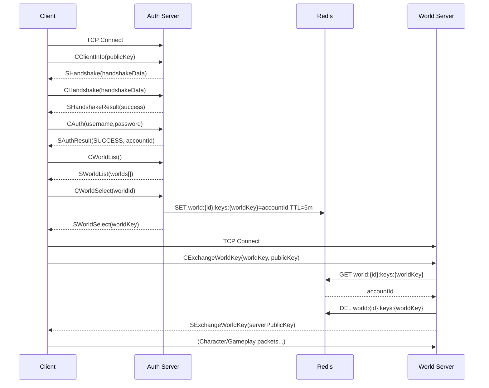

# Networking — Packet Protocol

Custom TCP layer with Protobuf-net serialization. Every client↔server message wraps a `NetworkPacket` (header + payload).

## Header Fields (`NetworkPacketHeader`)

| Field | Type | Purpose |
|---|---|---|
| `Type` | `NetworkPacketType` | Semantic opcode / message type (e.g., `CAuthPacket` → `CMSG_AUTH`) |
| `Flags` | `NetworkPacketFlags` | Bitmask: Encryption, Compression, Reserved — enables fast checks without parsing payload |
| `Protocol` | `NetworkProtocol` | Logical channel grouping (Authentication, World, Social, Character) |
| `Version` | `int` | Protocol version for backward compatibility |

Transport: plain TCP sockets (one connection per phase: Auth, then World). Ordering guaranteed by TCP.  
Encryption: session crypto negotiated via ephemeral public key exchange during handshake stages.  
Size calculation uses fixed field lengths; header marshaled first enabling preallocation.

## Auth Phase Lifecycle

1. `CClientInfoPacket` — client sends its ephemeral public key.
2. `SHandshakePacket` — server returns handshake data (server challenge).
3. `CHandshakePacket` — client proves possession / echoes handshake data.
4. `SHandshakeResultPacket` — indicates success and signals encryption activation.
5. `CAuthPacket` — credentials (username + password; server BCrypt verifies).
6. `SAuthResultPacket` — status (`SUCCESS`, `LOCKED`, `MFA_REQUIRED`, etc.) and `AccountId` on success.
7. `CWorldListPacket` — client requests accessible world list.
8. `SWorldListPacket` — worlds filtered by account access level.
9. `CWorldSelectPacket(WorldId)` — client chooses target world.
10. `SWorldSelectPacket(worldKey)` — server issues short-lived base64 `worldKey` stored in Redis (5 min TTL).

## World Handoff

11. Client opens new TCP connection to World server.
12. `CExchangeWorldKeyPacket(worldKey, publicKey)` — provides issued key + new ephemeral public key for world session.
13. World server validates key via Redis (single-use), loads account, initializes crypto.
14. `SExchangeWorldKeyPacket(serverPublicKey)` — confirms acceptance & provides server public key.
15. Subsequent packets (character list, selection, movement, chat) proceed under world session context.

## Redis Usage in Flow

- `world:{worldId}:keys:{worldKeyBase64}` → `accountId` (TTL ~5 min) — deleted immediately after successful world key exchange.
- `account:{accountId}:inWorld` — SETNX duplicate-session mutex written during `CWorldSelect`, cleared after successful key exchange (5 min TTL).
- `auth:accounts:online` / `world:accounts:disconnect` — pub/sub channels for cross-component presence coordination.

See [Redis Cache Keys](redis-cache-keys.md) for the full key reference.

## Failure Modes & Safeguards

- Invalid handshake data → connection closed (avoid resource waste).
- Wrong key size → rejected prior to crypto init.
- Invalid or expired world key → silent reject (prevents brute-force enumeration).
- Multiple logins for same account → previously connected session force-disconnected via pub/sub event.

## Security Considerations

- Single-use world keys mitigate replay (removed after exchange).
- Separation of Auth and World keys limits blast radius of a compromised session token.
- Public key re-exchange on world join prevents key reuse across phases.
- Planned: rate limiting handshake attempts and exponential backoff on auth failures.

## Extensibility

- **Add a new packet type:** define Protobuf contract, assign `NetworkPacketType` enum value, implement handler (`IAuthPacketHandler<T>` or `IWorldPacketHandler<T>`), register via reflection scan (attribute-driven).
- **Version evolution:** introduce parallel handlers keyed off `Header.Version` while keeping backward compatibility.
- **Optional compression:** introduce via `Flags` without breaking existing decoding.

## Sequence Diagram

Flow summary:
1. Secure ephemeral key negotiation (Auth)
2. Credentials verification & session marking
3. World discovery & selection with access filtering
4. One-time world key issuance (Redis-backed)
5. World server validation + second crypto establishment
6. Transition to gameplay channel
