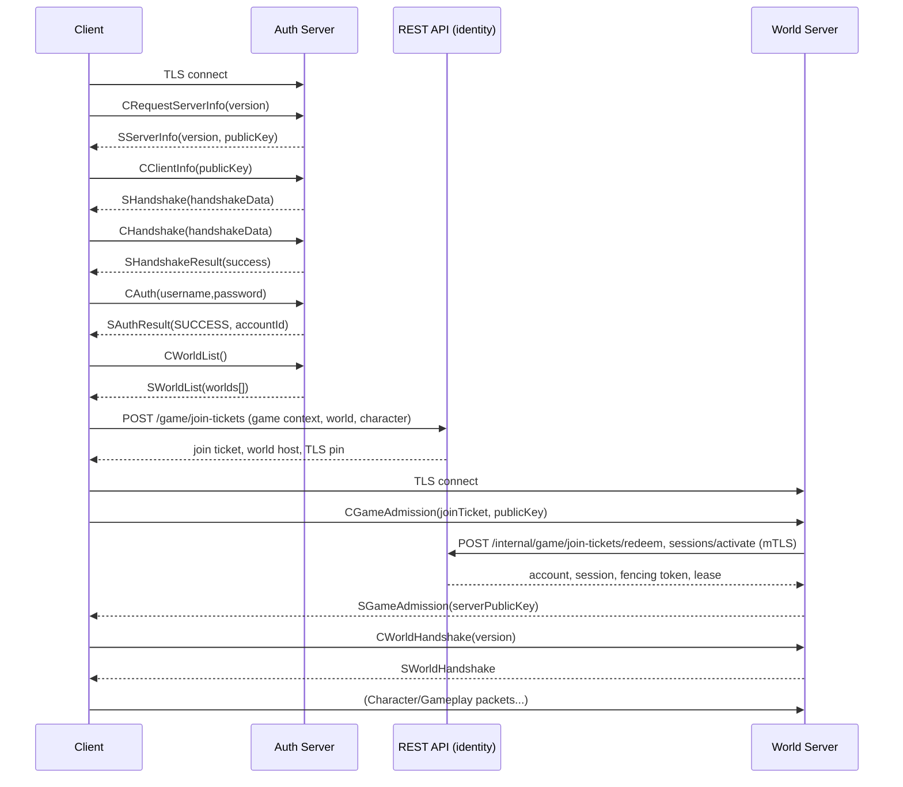

# Networking — Packet Protocol

Custom TCP layer with Protobuf-net serialization. Every client↔server message wraps a `NetworkPacket` (header + payload).

## Header Fields (`NetworkPacketHeader`)

| Field | Type | Purpose |
|---|---|---|
| `Type` | `NetworkPacketType` | Semantic opcode / message type (e.g., `CAuthPacket` → `CMSG_AUTH`) |
| `Flags` | `NetworkPacketFlags` | Bitmask: Encryption, Compression, Reserved — enables fast checks without parsing payload |
| `Protocol` | `NetworkProtocol` | Logical channel grouping (Authentication, World, Social, Character) |
| `Version` | `int` | Protocol version for backward compatibility |

The header is a struct (`NetworkPacketHeader`), read by hand from each frame by `InboundPacketFrame.ParseFrame`, so
neither a received frame nor a sent packet allocates a header (#875); the wire is unchanged.

Transport: TCP inside TLS, one connection per phase (Auth, then World). The auth server wraps every accepted socket in
TLS 1.2 with its certificate, the world server in TLS 1.2 or 1.3 with its own (both `Hosting:Security:CertificatePath`),
and a client pins the world's leaf named in its join reply. Ordering guaranteed by TCP.  
Encryption: inside TLS, session crypto negotiated via ephemeral public key exchange during handshake stages; on the
world server the per-packet session layer is a per-world setting, `Network:PacketEncryption`, off by default (#875).  
Size calculation uses fixed field lengths; header marshaled first enabling preallocation.

## Sending a packet

A server packet's `Create` (`S*Packet.Create`) returns an `OutboundPacket`: its header, and its message encoded, plain,
into a pooled `PayloadSegment` by `PacketEncoder` (#875). `IConnection.Send` takes the packet's payload reference. The
connection's outbox (a world connection's send thread, the auth server's outbox as its drain task writes) seals the
payload of a packet flagged Encrypted only when the outbox seals (`IOutbox.Seals`): always on the auth server, and on
a world connection only with `Network:PacketEncryption`. Otherwise the payload goes plain inside TLS and the header
loses the Encrypted flag, so the client opens nothing. The outbox frames the packet with `PacketEnvelope`:
`[varint length][NetworkPacket{1: header, 2: payload}]`, written by hand, byte for byte what protobuf-net writes for a
`NetworkPacket`, then releases the segment to its pool: no `byte[]` per packet.

A broadcast whose bytes are the same for every recipient (a hit, a cast, a death, a heal, loot spawned or despawned,
instance and party chat, a party member's status) is encoded once, for the first recipient that hears it, and each
recipient takes a reference of its own (`OutboundPacket.Share`); the broadcaster releases its own after the loop (#875).
Each send thread copies the payload into its own connection's burst, sealing it there when its connection seals, and
releases its reference as it frames it, or at once when its connection refuses the packet; the segment is never sealed
in place, and it returns to its pool after the last reference. World-state packets (`SInstanceStateAdd/Update/Remove`,
the aura list and updates) stay per recipient: each recipient sees its own set.

Nor a message object per packet. `Create` fills the calling thread's instance of its message type
(`PacketEncoder.Scratch<T>()`) and encodes it before it returns, so one instance per thread serves every packet of that
type. A resetter compiled once per type, at the world server's startup (`PacketEncoder.PrepareServerPackets`, before
the port opens), sets every field back to a new message's value on every take and again once the message is written,
so no value of one packet reaches the next or stays referenced after it. A collection comes back null (protobuf-net
writes a null repeated field as it writes an empty one), so a factory assigns each collection it sends; a nested
message the template creates is shared by every thread, so a factory assigns it whole and never writes into it. A
member the reset cannot assign (a read-only field, a property without a setter) makes the type refuse to start.
`PacketEncoderScratchShould` dirties every member of every server packet and checks that the next take comes back as a
new message, and runs every factory and checks that a new thread's scratch still encodes as a new message does.

The client-to-server packets' `C*Packet.Create`, which only clients send (the load-test tool, the benchmarks and the
tests), still build a `NetworkPacket`, sealed as it is created.

## Auth Phase Lifecycle

1. `CRequestServerInfoPacket` — client sends its version; `SServerInfoPacket` answers with the server's version and
   public key, or refuses a client below `Application:MinClientVersion` and closes.
2. `CClientInfoPacket` — client sends its ephemeral public key.
3. `SHandshakePacket` — server returns handshake data (server challenge).
4. `CHandshakePacket` — client proves possession / echoes handshake data.
5. `SHandshakeResultPacket` — indicates success and signals encryption activation.
6. `CAuthPacket` — credentials (username + password; server BCrypt verifies).
7. `SAuthResultPacket` — status (`SUCCESS`, `LOCKED`, `MFA_REQUIRED`, etc.) and `AccountId` on success; with
   `MFA_REQUIRED`, an MFA hash that `CMFAVerifyPacket` sends back with the code.
8. `CWorldListPacket` — client requests accessible world list.
9. `SWorldListPacket` — worlds filtered by account access level, each with its derived status.

The auth phase ends there: the TCP world select and world-key handoff were retired with the TLS join-ticket admission,
and their opcodes are unassigned. [Auth server login flow](auth-server.md) has the rules of each step.

## World Admission

10. The client gets a join ticket from the REST API (`POST /game/join-tickets`, against its game context), bound to one
    world, character and world server, for at most 30 seconds.
11. Client opens a TCP connection to that world server and completes TLS.
12. `CGameAdmissionPacket(JoinTicket, PublicKey)` — clear text inside TLS: the ticket and a new ephemeral public key.
13. The world server redeems the ticket and activates the session through the API's internal admission routes, off the
    tick, then initializes the session crypto. The key exchange runs for every connection, whatever the world's mode, so
    a client that always seals keeps working (retiring it is #878).
14. `SGameAdmissionPacket(PublicKey, Result, PacketEncryption)` — `Accepted` with the server's public key and the
    world's mode (field 3, `Network:PacketEncryption`, #875): true, the client seals every gameplay packet it sends;
    false, TLS alone and it sends plain. The client seals exactly as told. Otherwise `InvalidRequest`,
    `AuthorizationRequired` or `ServiceUnavailable` (`UnsupportedClient` is declared beside them; this server refuses
    an old client at step 15 instead), `PacketEncryption` false, and the connection is closed.
15. `CWorldHandshakePacket(Version)` / `SWorldHandshakePacket` — sealed only when the world seals; the client's version
    must be at least 0.2.0 and the world's `MinVersion`, or the connection is closed.
16. Subsequent packets (character list, selection, movement, chat) proceed under the admitted session. A connection
    keeps the mode it was created and admitted under for its life; a change of the setting needs a restart.

Strictness of the mode (#875). With `Network:PacketEncryption` on, a plain packet the world runs (the version
handshake, and every packet a session filter names but the pong) closes the connection as a protocol violation, at
arrival, before any filter is asked (`WorldConnection.OnReceive`). Admission and pong are plain by design and accepted
plain. An opcode no world filter takes is dropped as before, whatever its flags. With the flag off, plain and sealed
are both accepted.

Compatibility of the mode (#875). A server opens a client packet by its header, sealed or not; a client opens a server
packet by its header too.

| Client | Server | Client to server | Server to client |
|---|---|---|---|
| before #875 | flag off | the client still seals; the server opens it by its header | plain; the client follows the header |
| before #875 | flag on | sealed, as before | sealed, as before |
| current | flag off | plain | plain |
| current | flag on | sealed | sealed |
| current | before #875 (field absent, reads false) | plain; that server decides by the header | sealed; the client follows the header |

## Redis Usage in Flow

- `auth:account:{accountId}:mfa` and `auth:mfa:hash:{sha256}` — the MFA step's state.
- `game-auth:{environment}:join-ticket:{digest}` — a join ticket, stored by its digest, redeemed once.
- `auth:accounts:online` / `world:accounts:disconnect` — pub/sub channels for cross-component presence coordination.

See [Redis Cache Keys](redis-cache-keys.md) for the full key reference.

## Failure Modes & Safeguards

- Invalid handshake data → connection closed (avoid resource waste).
- Wrong key size → rejected prior to crypto init.
- A malformed, expired, spent or foreign join ticket → `SGameAdmissionPacket` refusal and the connection closed; a
  world connection that is not admitted within 15 seconds is closed.
- Multiple logins for same account → previously connected session force-disconnected via pub/sub event.

## Open Defect — a `DateTime` loses its kind

A `DateTime` sent over the protocol arrives without knowing which zone it is in, and this is a
defect in the server rather than a property of the wire format a client has to live with.

protobuf-net encodes a `DateTime` as `bcl.DateTime`, which has a `kind` field, and writes only
the value and the scale. The loss is on the writing side alone: nothing populates the field, but
the reader honours it when it is there — hand protobuf-net a `bcl.DateTime` carrying `kind = 1`
and it returns a `DateTimeKind.Utc` timestamp, `kind = 2` and it returns a local one. So a
timestamp written as `DateTimeKind.Utc` comes back from the **server's own deserializer** as
`DateTimeKind.Unspecified`, and any code that then treats it as local — `ToLocalTime`, a
comparison against `DateTime.Now`, a format without an offset — shifts it silently by the host's
offset. Nothing raises.

Affected today: the two chat timestamps, `SChatMessagePacket.DateTime` and its client
counterpart. A client cannot recover the zone either and has to be told out of band.

Either end of a fix is viable and both are protocol changes. Populating the field is the smaller
one, and it needs no reader work at all: `RuntimeTypeModel.Default.IncludeDateTimeKind = true`,
set before the model first serializes a `DateTime`, writes `kind` and the round trip then keeps
it. That adds two bytes to every `DateTime` on the wire, so it is a wire change and the corpus
moves with it. The other end is to carry the timestamp as an explicit UTC tick count or a
`google.protobuf.Timestamp` and drop `bcl.DateTime` for these members. Until one is taken, treat
every received `DateTime` as UTC by convention and never call `ToLocalTime` on one.

`WireLimitsShould.Not_Carry_The_Kind_Of_A_DateTime` holds the current behaviour with the bytes
in it, so a fix will turn that test red rather than pass unnoticed.

## Security Considerations

- Single-use join tickets mitigate replay: a ticket lives at most 30 seconds, is bound to one world server, and is
  redeemed once, by that server, over its mutually authenticated workload connection.
- Separation of the auth and world sessions limits the blast radius of a compromised session token.
- Public key re-exchange on world join prevents key reuse across phases.
- Auth failures are budgeted per source and per username ([auth server](auth-server.md)).

## Extensibility

- **Add a new packet type:** define Protobuf contract, assign `NetworkPacketType` enum value, implement handler (`IAuthPacketHandler<T>` or `IWorldPacketHandler<T>`), register via reflection scan (attribute-driven).
- **Version evolution:** introduce parallel handlers keyed off `Header.Version` while keeping backward compatibility.
- **Optional compression:** introduce via `Flags` without breaking existing decoding.

## Sequence Diagram

```mermaid
sequenceDiagram
    participant Client
    participant Auth as Auth Server
    participant Api as REST API (identity)
    participant World as World Server

    Client->>Auth: TLS connect
    Client->>Auth: CRequestServerInfo(version)
    Auth-->>Client: SServerInfo(version, publicKey)
    Client->>Auth: CClientInfo(publicKey)
    Auth-->>Client: SHandshake(handshakeData)
    Client->>Auth: CHandshake(handshakeData)
    Auth-->>Client: SHandshakeResult(success)
    Client->>Auth: CAuth(username,password)
    Auth-->>Client: SAuthResult(SUCCESS, accountId)
    Client->>Auth: CWorldList()
    Auth-->>Client: SWorldList(worlds[])
    Client->>Api: POST /game/join-tickets (game context, world, character)
    Api-->>Client: join ticket, world host, TLS pin
    Client->>World: TLS connect
    Client->>World: CGameAdmission(joinTicket, publicKey)
    World->>Api: POST /internal/game/join-tickets/redeem, sessions/activate (mTLS)
    Api-->>World: account, session, fencing token, lease
    World-->>Client: SGameAdmission(serverPublicKey)
    Client->>World: CWorldHandshake(version)
    World-->>Client: SWorldHandshake
    Client->>World: (Character/Gameplay packets...)
```

Flow summary:
1. Secure ephemeral key negotiation (Auth)
2. Credentials verification & session marking
3. World discovery with access filtering
4. One-time join ticket issuance (REST game admission)
5. World server redemption + second crypto establishment
6. Transition to gameplay channel
