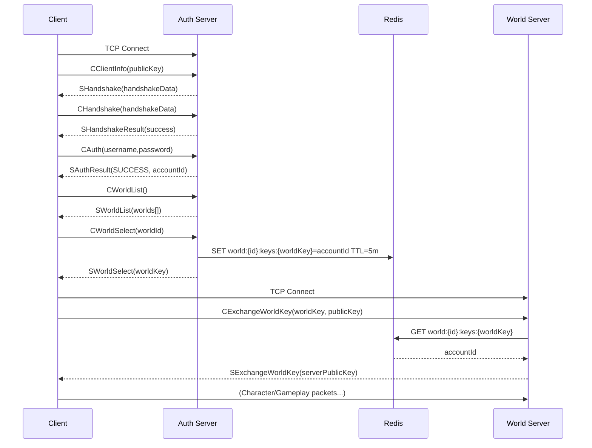

# README Refactor Implementation Plan

> **For agentic workers:** REQUIRED SUB-SKILL: Use superpowers:subagent-driven-development (recommended) or superpowers:executing-plans to implement this plan task-by-task. Steps use checkbox (`- [ ]`) syntax for tracking.

**Goal:** Move deep-dive technical content out of README into focused docs, leaving a readable ~160-line front-door document.

**Architecture:** Four new files are created first (content moved verbatim from README), then README is rewritten in one step. No code changes — docs only.

**Tech Stack:** Markdown, Mermaid (already used in README)

**Spec:** `docs/superpowers/specs/2026-04-08-readme-refactor-design.md`

---

## Task 1: Create `docs/networking-packet-protocol.md`

**Files:**
- Create: `docs/networking-packet-protocol.md`

- [ ] **Step 1: Create the file with content moved verbatim from README**

Create `docs/networking-packet-protocol.md` with the following content:

```markdown
# Networking — Packet Protocol

Custom TCP layer with Protobuf-net serialization. Every client↔server message wraps a `NetworkPacket` (header + payload).

## Header Fields (`NetworkPacketHeader`)

| Field | Type | Purpose |
|---|---|---|
| `Type` | `NetworkPacketType` | Semantic opcode / message type (e.g., `CAuthPacket` → `CMSG_AUTH`) |
| `Flags` | `NetworkPacketFlags` | Bitmask: Encryption, Compression, Reserved — enables fast checks without parsing payload |
| `Protocol` | `NetworkProtocol` | Logical channel grouping (Authentication, World, Social, Character) |
| `Version` | `int` | Protocol version for backward compatibility |

Transport: plain TCP sockets (one connection per phase: Auth, then World). Ordering guaranteed by TCP.  
Encryption: session crypto negotiated via ephemeral public key exchange during handshake stages.  
Size calculation uses fixed field lengths; header marshaled first enabling preallocation.

## Auth Phase Lifecycle

1. `CClientInfoPacket` — client sends its ephemeral public key.
2. `SHandshakePacket` — server returns handshake data (server challenge).
3. `CHandshakePacket` — client proves possession / echoes handshake data.
4. `SHandshakeResultPacket` — indicates success and signals encryption activation.
5. `CAuthPacket` — credentials (username + password; server BCrypt verifies).
6. `SAuthResultPacket` — status (`SUCCESS`, `LOCKED`, `MFA_REQUIRED`, etc.) and `AccountId` on success.
7. `CWorldListPacket` — client requests accessible world list.
8. `SWorldListPacket` — worlds filtered by account access level.
9. `CWorldSelectPacket(WorldId)` — client chooses target world.
10. `SWorldSelectPacket(worldKey)` — server issues short-lived base64 `worldKey` stored in Redis (5 min TTL).

## World Handoff

11. Client opens new TCP connection to World server.
12. `CExchangeWorldKeyPacket(worldKey, publicKey)` — provides issued key + new ephemeral public key for world session.
13. World server validates key via Redis (single-use), loads account, initializes crypto.
14. `SExchangeWorldKeyPacket(serverPublicKey)` — confirms acceptance & provides server public key.
15. Subsequent packets (character list, selection, movement, chat) proceed under world session context.

## Redis Usage in Flow

- `world:{WorldId}:keys:{Base64Key}` → `AccountId` (TTL ~5 min) — deleted immediately after successful world key exchange.
- `auth:accounts:online` / `world:accounts:disconnect` — pub/sub channels for cross-component presence coordination.

See [Redis Cache Keys](redis-cache-keys.md) for the full key reference.

## Failure Modes & Safeguards

- Invalid handshake data → connection closed (avoid resource waste).
- Wrong key size → rejected prior to crypto init.
- Invalid or expired world key → silent reject (prevents brute-force enumeration).
- Multiple logins for same account → previously connected session force-disconnected via pub/sub event.

## Security Considerations

- Single-use world keys mitigate replay (removed after exchange).
- Separation of Auth and World keys limits blast radius of a compromised session token.
- Public key re-exchange on world join prevents key reuse across phases.
- Planned: rate limiting handshake attempts and exponential backoff on auth failures.

## Extensibility

- **Add a new packet type:** define Protobuf contract, assign `NetworkPacketType` enum value, implement handler (`IAuthPacketHandler<T>` or `IWorldPacketHandler<T>`), register via reflection scan (attribute-driven).
- **Version evolution:** introduce parallel handlers keyed off `Header.Version` while keeping backward compatibility.
- **Optional compression:** introduce via `Flags` without breaking existing decoding.

## Sequence Diagram



Flow summary:
1. Secure ephemeral key negotiation (Auth)
2. Credentials verification & session marking
3. World discovery & selection with access filtering
4. One-time world key issuance (Redis-backed)
5. World server validation + second crypto establishment
6. Transition to gameplay channel
```

- [ ] **Step 2: Commit**

```bash
git add docs/networking-packet-protocol.md
git commit -m "docs: add networking packet protocol reference"
```

---

## Task 2: Create `docs/architecture-startup-flow.md`

**Files:**
- Create: `docs/architecture-startup-flow.md`

- [ ] **Step 1: Create the file with content moved verbatim from README**

Create `docs/architecture-startup-flow.md` with the following content:

```markdown
# Architecture — Startup Flow

Bootstrap sequence for each server component.

## API

1. Build `WebApplicationBuilder`
2. Bind `ApplicationConfig`
3. Register JSON options + converters (`ValueObjectJsonConverterFactory` + `JsonStringEnumConverter`)
4. Configure OpenAPI + schema transformations (ValueObject → scalar)
5. Add Auth, Infrastructure, AutoMapper profiles
6. Build / apply EF migrations / start workers / connect Redis
7. Expose OpenAPI (`MapOpenApi` + Scalar UI at `/scalar`)

## Auth Server & World Server

1. `AvalonHostBuilder.CreateHostAsync` — sets working directory, core services, JSON options
2. `ConfigureOpenTelemetry`
3. Register `HostedService` (`AuthServer` / `WorldServer`) + specialized services
4. Migrate respective databases
5. Connect Redis
6. Run hosted loop
```

- [ ] **Step 2: Commit**

```bash
git add docs/architecture-startup-flow.md
git commit -m "docs: add architecture startup flow reference"
```

---

## Task 3: Create `docs/valueobject-openapi.md`

**Files:**
- Create: `docs/valueobject-openapi.md`

- [ ] **Step 1: Create the file with content moved verbatim from README**

Create `docs/valueobject-openapi.md` with the following content:

```markdown
# ValueObject — OpenAPI Integration

With .NET 10's `Microsoft.AspNetCore.OpenApi` pipeline, `ValueObject<T>` types must be represented as their underlying scalar in the generated schema — not as wrapper objects like `{ value: 123 }`.

## Transformer Pattern

Implement `IOpenApiSchemaTransformer` (`ValueObjectOpenapiSchemaTransformer`):

- Register via `options.AddSchemaTransformer<ValueObjectOpenapiSchemaTransformer>()`
- During transformation: detect inheritance chain for `ValueObject<>`, clear the object schema shape, copy underlying primitive semantics (enum, number, string, etc.)

This produces clean scalar schemas. Runtime JSON serialization already emits raw primitive values via `ValueObjectJsonConverterFactory`.

> **Note:** Do not use legacy Swashbuckle methods (e.g., `GetOrCreateSchemaAsync`) — they are not compatible with the .NET 10 OpenAPI pipeline.
```

- [ ] **Step 2: Commit**

```bash
git add docs/valueobject-openapi.md
git commit -m "docs: add ValueObject OpenAPI integration reference"
```

---

## Task 4: Create `CONTRIBUTING.md`

**Files:**
- Create: `CONTRIBUTING.md`

- [ ] **Step 1: Create CONTRIBUTING.md at the repo root**

Create `CONTRIBUTING.md` with the following content:

```markdown
# Contributing

## Getting Started

1. Fork the repository and create a feature branch.
2. Run tests before opening a PR: `dotnet test`
3. Run benchmarks if touching simulation hot paths: `dotnet run -c Release --project tools/Avalon.Benchmarking`
4. Keep new abstractions in `*.Public` projects if they are shared across server boundaries.
5. Update docs for any structural change.

## Extending the Domain

### Add a new `ValueObject<T>`

1. Create a class deriving from `ValueObject<TPrimitive>` in `src/Shared/Avalon.Common`.
2. Add validation rules in the constructor or factory method.
3. OpenAPI schema and JSON serialization are handled automatically — no extra registration needed.

### Add a packet handler

**Auth server** (`src/Server/Avalon.Server.Auth/Handlers/`):
1. Define the packet contract in `Avalon.Network.Packets` with a new `NetworkPacketType` enum value.
2. Implement `IAuthPacketHandler<TPacket>`.
3. Register in DI — Auth handlers are resolved manually from the container.

**World server** (`src/Server/Avalon.Server.World/Handlers/`):
1. Define the packet contract in `Avalon.Network.Packets` with a new `NetworkPacketType` enum value.
2. Implement `IWorldPacketHandler<TPacket>`, decorated with `[PacketHandler(NetworkPacketType.X)]`.
3. No manual registration needed — handlers are discovered via reflection scan in the `WorldServer` constructor.

See [Networking — Packet Protocol](docs/networking-packet-protocol.md) for the full protocol reference.

### Add a world script

1. Define the contract in `src/Server/Avalon.World.Scripts.Abstractions`.
2. Implement in `src/Server/Avalon.World.Scripts`.
3. Register via the DI extension method in `Avalon.World`'s `ServiceExtensions`.
```

- [ ] **Step 2: Commit**

```bash
git add CONTRIBUTING.md
git commit -m "docs: add CONTRIBUTING.md with extension patterns"
```

---

## Task 5: Rewrite `README.md`

**Files:**
- Modify: `README.md`

- [ ] **Step 1: Replace README.md with the refactored version**

Replace the entire contents of `README.md` with:

```markdown
# Avalon.Server

Official server-side solution for the Avalon MMORPG: API, authentication, world simulation, networking, persistence,
telemetry, and extensibility frameworks.

## High-Level Overview

Avalon is split into bounded components that can scale and evolve independently:

- Public REST API (account + meta operations)
- Real‑time Auth server (login / token / world selection)
- Real‑time World server (simulation, state replication, gameplay logic)
- Shared foundational libraries (domain model, networking, value objects, metrics, configuration)
- Infrastructure services (Redis, Postgres)
- Tooling (migrations, benchmarking, scripting, migration console)

Communication paths:

- Clients → API (HTTPS + JWT) for out‑of‑band operations (account, web UX, management)
- Game Client → Auth Server (custom TCP packet protocol) for authentication & world ticket exchange
- Auth Server ↔ Redis (session, ephemeral keys, pub/sub)
- World Server ↔ Redis (cross‑node coordination, session/materialized view, pub/sub)
- World Server ↔ Databases (persistent character/world state)
- API ↔ Databases (account + world metadata) & Redis (caching, notifications)

## Solution Structure (Key Projects)

Server layer:

| Project | Role |
|---|---|
| `src/Server/Avalon` | [Aspire](https://dotnet.microsoft.com/en-us/apps/aspire) host for all server components |
| `src/Server/Avalon.Api` | ASP.NET Core REST API; OpenAPI generation; JWT issuance; JSON serialization |
| `src/Server/Avalon.Server.Auth` | Hosted service wrapping AuthServer (packet dispatcher, login flow, MFA) |
| `src/Server/Avalon.Server.World` | Hosted service running the simulation loop (maps, entities, spells, spawning) |
| `src/Server/Avalon.World` | Core world implementation (maps, grid, entities, spells, sessions, connections) |
| `src/Server/Avalon.World.Public` | Public abstractions (interfaces) consumed by other layers |
| `src/Server/Avalon.World.Scripts` / `.Abstractions` | Scripting system boundary for gameplay extensions |
| `src/Server/Avalon.Infrastructure` | Redis replicated cache, MFA hashing, config binding, helper services |
| `src/Server/Avalon.Database.*` | EF Core contexts and repositories (Auth, Character, World) + migrations |
| `src/Server/Avalon.Hosting` | Uniform host bootstrap (`AvalonHostBuilder`): converters, telemetry, configuration |
| `src/Server/Avalon.ServiceDefaults` | Shared service registration (logging, OpenTelemetry, resiliency, service discovery) |
| `src/Server/Avalon.PluginFramework` | Foundation for dynamic plugin loading (future roadmap) |

Shared libraries:

| Project | Role |
|---|---|
| `src/Shared/Avalon.Common` | `ValueObject<T>`, common utilities, JSON converters |
| `src/Shared/Avalon.Domain` | Rich domain model (Auth, Accounts, Devices, Worlds, etc.) |
| `src/Shared/Avalon.Configuration` | Strongly typed configuration objects |
| `src/Shared/Avalon.Network.*` | Custom packet protocol, attributes, base handlers, contracts |
| `src/Shared/Avalon.Metrics` | OpenTelemetry integration points |

Tooling & Tests:

| Project | Role |
|---|---|
| `tools/Avalon.Benchmarking` | Micro-benchmarks for performance-sensitive components |
| `tests/Avalon.Shared.UnitTests` | Unit tests for shared libraries |
| `tests/Avalon.Server.Auth.UnitTests` | Unit tests for authentication server components |
| `tests/Avalon.Server.World.UnitTests` | Unit tests for world server and simulation logic |
| `tests/Avalon.Api.UnitTests` | Unit tests for the REST API |

## Core Cross-Cutting Concepts

### Value Objects

`ValueObject<TValue>` in `Avalon.Common` wraps primitives like `AccountId` and `WorldId` for strong typing. They serialize to their underlying primitive via custom `System.Text.Json` converters and appear as scalars in OpenAPI through a custom schema transformer. See → [ValueObject — OpenAPI Integration](docs/valueobject-openapi.md)

### OpenAPI & Scalar UI

The API exposes an interactive Scalar UI at `/scalar` and raw schema at `/openapi/v1.json`, built on `Microsoft.AspNetCore.OpenApi`. A custom schema transformer produces clean scalar definitions for value object types.

### Authentication & Security

JWT issuance and validation, MFA (Otp.NET) with Redis-backed ephemeral secrets, BCrypt password hashing, refresh tokens, and session tracking in `AuthDb`. See → [Security — Session Management](docs/security-session-management.md)

### Networking

Custom TCP layer (`Avalon.Network.Tcp`) with Protobuf-net serialization and reflection-based packet handler registration. Auth and World servers share packet abstractions via `Avalon.Network.Packets`. See → [Networking — Packet Protocol](docs/networking-packet-protocol.md)

### Caching & Pub/Sub

Redis (via `IReplicatedCache`) manages ephemeral session keys, MFA secrets, world exchange tokens, and cross-service pub/sub events. See → [Redis Cache Keys](docs/redis-cache-keys.md)

### Persistence

Postgres via Npgsql EF Core with three distinct DbContexts (`AuthDbContext`, `CharacterDbContext`, `WorldDbContext`) for separation of concerns and independent scaling. Design-time factories enable `dotnet ef` without a running host.

### Telemetry & Logging

Serilog for structured logging; OpenTelemetry instrumentation covers HTTP, EF Core, Redis, and runtime metrics. See → [Configuration Reference](docs/configuration-reference.md)

### World Simulation

`WorldServer` hosted service runs the tick loop at ~60 Hz. Each `MapInstance` manages entities, spell queues, creature AI, and state broadcast. See → [Spell System](docs/spell-system.md) · [Creature System](docs/creature-system.md) · [Architecture — Startup Flow](docs/architecture-startup-flow.md)

### Scripting & Extensibility

`Avalon.World.Scripts.Abstractions` isolates contracts for externally defined gameplay logic. Future dynamic loading planned via `PluginFramework`.

## Running Locally

Prerequisites: .NET 10 SDK, Docker (for infra services).

1. Start infra (Redis + PostgreSQL):
   ```bash
   docker compose up -d
   ```
   Optionally add Redis Insight for a GUI over Redis:
   ```bash
   docker compose -f docker-compose.yml -f docker-compose.tools.yml up -d
   ```
2. Run the API — migrations are applied automatically on startup:
   ```bash
   dotnet run --project src/Server/Avalon.Api
   ```
3. Run Auth Server:
   ```bash
   dotnet run --project src/Server/Avalon.Server.Auth
   ```
4. Run World Server:
   ```bash
   dotnet run --project src/Server/Avalon.Server.World
   ```
5. Open API docs: `https://localhost:<port>/scalar` (Scalar UI) or `/openapi/v1.json`

## Migrations Workflow

> **Note:** During early development, `Avalon.Api` is used as the EF design-time startup project and applies migrations automatically on startup. Migration generation and execution will be decoupled as the project matures.

Generate a migration:
```bash
dotnet ef migrations add <Name> \
  --project src/Server/Avalon.Database.Auth \
  --startup-project src/Server/Avalon.Api \
  --context AuthDbContext
```
Replace `Auth` / `AuthDbContext` with `Character` / `CharacterDbContext` or `World` / `WorldDbContext` as needed.

## Testing

```bash
dotnet test
```

Run a specific project: `dotnet test tests/Avalon.Server.Auth.UnitTests`

## Benchmarking

```bash
dotnet run -c Release --project tools/Avalon.Benchmarking
```

Use to regress-check simulation hot paths.

## Feature Documentation

| Document | Description |
|---|---|
| [Networking — Packet Protocol](docs/networking-packet-protocol.md) | Header fields, auth lifecycle, world handoff, Redis patterns, failure modes |
| [Networking — Graceful Shutdown](docs/networking-graceful-shutdown.md) | Connection lifecycle, `SDisconnectPacket` schema, shutdown sequences |
| [Security — Session Management](docs/security-session-management.md) | Auth flow, world key CSPRNG, bearer token validation, duplicate session guard |
| [Architecture — Startup Flow](docs/architecture-startup-flow.md) | Bootstrap sequence for API, Auth Server, and World Server |
| [ValueObject — OpenAPI Integration](docs/valueobject-openapi.md) | Schema transformer pattern, registration, and shape transformation |
| [Configuration Reference](docs/configuration-reference.md) | All `appsettings.json` keys, validation rules, environment override guidance |
| [Redis Cache Keys](docs/redis-cache-keys.md) | All Redis key patterns and pub/sub channels: purpose, TTL, writer/consumer |
| [Spell System](docs/spell-system.md) | Spell lifecycle, power cost deduction, AoE targeting, creature spell support |
| [Creature System](docs/creature-system.md) | Creature lifecycle, AI scripting, XP rewards, respawn/remove timers |
| [Character Login Flow](docs/character-login-flow.md) | World-select → spawn sequence, inventory on login, instance ID design |
| [Architecture Decisions](docs/architecture-decisions.md) | ADRs: World/Auth DB decoupling, chat command handler pattern, specializations |

For the full list of pending work items see [TODO.md](TODO.md).

## Roadmap

- Plugin hot-reload & isolation boundaries
- Horizontal world shard scaling (multi-process coordination via Redis pub/sub)
- Observability dashboards (Grafana / Prometheus integration)
- More test coverage (property-based / fuzzing for packet protocol)
- Rate limiting & advanced DDoS mitigation

## License

MIT (see repository root). Some vendor components (DotRecast, Raylib bindings) under their respective licenses.

## Contributing

See [CONTRIBUTING.md](CONTRIBUTING.md) for guidelines, extension patterns, and how to run tests before opening a PR.
```

- [ ] **Step 2: Commit**

```bash
git add README.md
git commit -m "docs: refactor README — move deep dives to dedicated docs"
```
